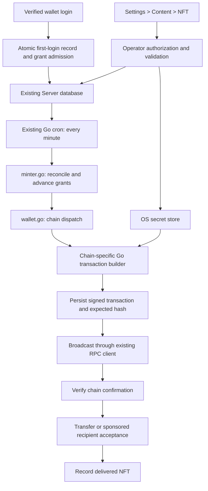

# Auto-NFT: Research and Proposed Implementation

Status: proposal for review, not approved for implementation. Research date: September 14, 2026.

Add automatic welcome-NFT issuance to the existing Server binary. A verified first login records eligibility and a durable grant in the Server database. The existing Go cron scheduler advances those grants through minting, confirmation, and delivery. The coordinator lives at `Server/src/core/blockchain/minter.go`; blockchain-specific operations remain in the existing blockchain abstraction and chain files.

Configuration belongs under Settings > Content > NFT. The server operator enables Auto-Minting, configures the collection and metadata, and supplies the sender's seed phrase or private key through collapsible, masked controls. Signing material stays in the operating system's secret store.

## 1. Decisions to Review

These recommendations make the proposal concrete. They are not confirmations of choices you have not yet made.

| Decision | Proposed behavior |
| --- | --- |
| Wallet coverage | Base, Ethereum, local Base wallets, and Algorand/Pera. |
| Network mapping | Base login receives on Base; Ethereum login receives on Ethereum; Algorand login receives on Algorand. This changes the earlier assumption that Ethereum logins receive on Base. |
| Algorand acceptance | Include a recipient-approved, gateway-sponsored opt-in. The grant waits for that approval; it cannot be delivered silently to a wallet that has not opted into its new asset. |
| First-login scope | Once per wallet identity on its blockchain, within this Server database. Existing records cannot establish lifetime login history before this feature is installed. |
| Rollout policy | Start recording logins when the migration ships. Previously unrecorded wallets count as new on their first subsequent login. Do not infer prior login from an indexed profile. |
| Disabled behavior | Record first login, but do not create an eligible grant when Auto-Minting is disabled. Re-enabling does not retroactively grant NFTs to those logins. Existing eligible grants resume. |
| Sender registration | Require an explicitly registered sender per configured chain; importing credentials must derive that address. Use existing nonzero server-account metadata where applicable. |
| Gateway administrator | Authorize the registered server operator, not any authenticated wallet. The source of the gateway's actual registered address still needs confirmation. |
| EVM contract | Configured YourPlace-compatible ERC-721 supporting `mint(string)`, `mintFee()`, `ownerOf()`, `tokenURI()`, and `safeTransferFrom(address,address,uint256)`. No new contract deployment is part of this feature. |
| Algorand asset controls | Keep the current wallet implementation's manager/reserve/freeze/clawback behavior for compatibility. This means the issuer retains those powers; an immutable/no-clawback variant would be a separate explicit choice. |
| Spending | Require operator-selected per-chain fee and daily issuance limits before enabling. The recipient pays no mint or delivery fees. |

An Ethereum address is not a universal identity across unrelated chains, especially for contract wallets. If both EVM login types are deliberately mapped to Base, deduplication must instead be by destination network and address, and wallet control on the destination network needs consideration. The default above avoids that assumption.

## 2. What the Research Established

### Login and Eligibility

[login.go](/Users/nops/Code/YourPlace/Server/src/routes/login.go:94) has four successful wallet-login paths: Base, Ethereum, local Base, and Pera. Each verifies the wallet, creates an authentication cookie, and calls `OnchainMN`. The proposed hook belongs after successful authentication, before the success response. Nonce creation, `/login/check`, cookie rotation, profile viewing, and wallet connection alone must not grant NFTs.

[OnchainMN](/Users/nops/Code/YourPlace/Server/src/core/db/sqlite.go:2767) is an on-chain profile upsert, not a record of a first login. The indexers can create these profiles for people who have never used this gateway. It neither returns a reliable first-login result nor supplies an appropriate grant ledger.

[cookie.go](/Users/nops/Code/YourPlace/Server/src/core/security/cookie.go:25) writes authentication nonces and encrypted cookies, but the current auth tables do not retain a permanent address-based login history. Consequently, strict historical "first time ever" cannot be reconstructed from the inspected database schema. The feature can enforce it prospectively; it cannot honestly promise a network-wide, person-wide, or pre-migration guarantee.

### Scheduler and Blockchain Plumbing

[StartCronJobs](/Users/nops/Code/YourPlace/Server/main.go:547) already uses `robfig/cron/v3` with seconds enabled. Cron starts for an installed Server, and the blockchain clients exist before it starts. The minter can register an independent `@every 1m` job outside the indexer flag and battery checks.

[blockchain.go](/Users/nops/Code/YourPlace/Server/src/core/blockchain/blockchain.go:15) already owns the Algorand, Base, and Ethereum clients. Base and Ethereum expose `EthClient` and `RpcClient`; Algorand owns an `algodClient`. [wallet.go](/Users/nops/Code/YourPlace/Server/src/core/blockchain/wallet.go:27) is the existing place for cross-chain dispatch.

[go.mod](/Users/nops/Code/YourPlace/Server/go.mod:15) directly includes go-ethereum v1.17.1, Algorand SDK v2.11.1, and cron v3.0.1. Their locally installed source confirms support for constructing/signing transactions separately from broadcasting: go-ethereum's binding `NoSend` option, and Algorand's `SignTransaction`, which returns both a transaction ID and signed bytes. This supports a durable transaction journal without adding a transaction-submission service. [go-ethereum binding source](https://github.com/ethereum/go-ethereum/blob/v1.17.1/accounts/abi/bind/v2/base.go).

Existing Go blockchain plumbing is mostly reads and indexing. It does not contain a reusable NFT issuance worker or EVM mnemonic importer. The old Algorand `CreateTransaction`/`SubmitTransaction` helpers use unbounded contexts and terminate or print in some error paths. The new chain methods should reuse the initialized client and SDK, with bounded contexts and returned errors, rather than inherit those behaviors. [algorand.go](/Users/nops/Code/YourPlace/Server/src/core/blockchain/algorand.go:101).

### Actual NFT Behavior

Both chain directories contain `YourPlaceCollectible.sol`. The inspected [Base contract source](/Users/nops/Code/YourPlace/Server/src/solidity/base/nft/YourPlaceCollectible.sol:36) mints to `msg.sender`, requires the exact current mint fee, emits `Minted` and standard transfer events, and assigns royalties to the minter. Therefore, this interface requires a mint transaction followed by a transfer transaction. Token ID zero is valid. "Free" means the gateway funds the fee and gas; it does not mean the contract waives its fee. These are source-code findings, not verification of any deployed contract's bytecode.

The [Base browser function](/Users/nops/Code/YourPlace/Server/src/typescript/util/blockchain/base.ts:774) uses the connected wallet and a hardcoded transaction value. Its ABI also includes `mintFee()`. The server should query that value and enforce a configured maximum before signing instead of copying the hardcoded fee.

ERC-721 does not standardize a `mint` method. A configured address being ERC-721-compatible does not prove that `mint(string)` exists or has the expected semantics. Safe transfers can also be rejected by recipient contracts. Require the explicit supported interface and retain the same minted token if delivery fails. [ERC-721 standard](https://eips.ethereum.org/EIPS/eip-721).

The [Algorand browser function](/Users/nops/Code/YourPlace/Server/src/typescript/util/blockchain/algorand.ts:528) creates a supply-one, zero-decimal ASA, uses an `ipfs://...#arc3` metadata URL, retains issuer control addresses, and groups creation with a 100-microALGO platform payment. It signs through Pera. Server cron cannot invoke that browser signing flow; it must implement equivalent issuance using the existing Go SDK.

Algorand requires a recipient opt-in before an ASA transfer. The extra asset holding also increases the recipient's minimum balance. Sponsoring a transfer fee alone does not make delivery free to an unfunded recipient. [Asset operations](https://dev.algorand.co/concepts/assets/asset-operations/), [asset opt-in balance requirement](https://dev.algorand.co/docs/algokit-utils/typescript/latest/concepts/building/asset/).

ARC-3 specifies a metadata hash as well as URL conventions. The current browser creation code does not set this hash. The new Go path should hash the exact metadata bytes: SHA-256 for ordinary metadata, with the ARC-3-specific rule if `extra_metadata` is supported. For the initial implementation, reject that optional extension and document ordinary ARC-3 metadata support. [ARC-3 specification](https://dev.algorand.co/arc-standards/arc-0003/).

The existing [HashBytes helper](/Users/nops/Code/YourPlace/Server/src/core/security/cryptography.go:117) uses SHA3-512, so it must not be reused as an ARC-3 SHA-256 hash. Add a specifically named SHA-256 byte helper in the existing cryptography file without changing the semantics of `HashBytes`.

### Settings, Authority, and Secret Storage

[settings.tmpl](/Users/nops/Code/YourPlace/Server/src/templates/pages/settings.tmpl:49) already has Content and nested sections. [settings.ts](/Users/nops/Code/YourPlace/Server/src/typescript/pages/settings.ts:177) disables gateway settings controls and skips Content data loading in gateway mode. Adding template inputs alone would leave the feature unusable there.

[GatewayMiddleware](/Users/nops/Code/YourPlace/Server/src/core/middleware/gateway.go:38) rejects all settings writes in gateway mode and only permits selected settings reads. [LoopbackMiddleware](/Users/nops/Code/YourPlace/Server/src/core/middleware/loopback.go:18) separately restricts settings paths. Both need narrowly scoped handling for the new NFT endpoints. An entry in the public gateway GET allowlist is not sufficient authorization for private minter settings.

[SetGatewayDefaultSettings](/Users/nops/Code/YourPlace/Server/src/core/db/database.go:69) initializes `accountAddress` to the zero address and `accountNetwork` to Base. [setup.go](/Users/nops/Code/YourPlace/Server/src/routes/setup.go:89) stores the desktop server account, but gateway setup is blocked. No other registered gateway signing-wallet source was found in the inspected startup, routes, gateway scripts, or gateway infrastructure. A logged-in user's `accountAddress` in Gin context is their session identity, not proof that they own the server.

| OS | Existing implementation | Required adjustment |
| --- | --- | --- |
| macOS | `security` command and Keychain in [osx.go](/Users/nops/Code/YourPlace/Server/src/core/host/osx.go:251) | Return errors; support replacement; preserve secret bytes rather than run a path sanitizer over them. |
| Windows | `wincred` in [windows.go](/Users/nops/Code/YourPlace/Server/src/core/host/windows.go:621) | Return errors; implement deletion, which is currently a stub. |
| Linux | `secret-tool` in [unix.go](/Users/nops/Code/YourPlace/Server/src/core/host/unix.go:198) | Return errors and enforce timeouts; ensure an available, unlocked Secret Service in the gateway runtime. |

The current `AddSecret` functions return no error, so a route cannot reliably know that saving succeeded. Linux needs more than the `secret-tool` executable: locked Secret Service collections cannot be read or modified. [Secret Service behavior](https://specifications.freedesktop.org/secret-service/latest/ch03.html).

### Build, Deployment, and Display

[gateway/Dockerfile](/Users/nops/Code/YourPlace/Server/gateway/Dockerfile:20) does not install a Secret Service client/backend or arrange an unlocked keyring. The gateway uses a Docker container and a persistent `/opt/YourPlace` mount; [deploy.sh](/Users/nops/Code/YourPlace/Server/gateway/deploy.sh:162) can configure MySQL through an instance-profile Secrets Manager lookup. The queue should use whichever database `main.go` initializes, not assume a local SQLite file.

[gateway.yml](/Users/nops/Code/YourPlace/Server/.github/workflows/gateway.yml:26) triggers the Ubuntu build, waits, then builds the gateway image. That image downloads a versioned Server binary. The integrated minter is included by the existing `gateway_build` target. Secret-store provisioning and preserving database/keyring state still require deployment work.

The [Base gallery](/Users/nops/Code/YourPlace/Server/src/typescript/util/blockchain/base.ts:704) enumerates only `YP_NFT_CONTRACT_ADDRESS`. [Ethereum collectible methods](/Users/nops/Code/YourPlace/Server/src/typescript/util/blockchain/ethereum.ts:504) are stubs. A welcome NFT minted into a separately configured contract would otherwise be invisible or unusable in YourPlace. Profile action handlers also omit the card's contract address even though [domFactory.ts](/Users/nops/Code/YourPlace/Server/src/typescript/util/domFactory.ts:147) stores it.

## 3. Proposed Architecture



`minter.go` owns eligibility policy, configuration, the worker, recovery, and status. It does not implement EVM ABI encoding, Algorand asset transactions, or browser signing. `wallet.go` selects chain methods. Base, Ethereum, and Algorand methods stay in their respective existing Go files, using small, explicitly shared EVM helpers where appropriate.

The minter runs with indexers disabled and does not write grants into `onchain_*` tables. It does not depend on `gatewayMintEnabled`, which currently means that the interactive NFT-upload/pinning path is available. An already-pinned welcome-NFT metadata URI is a separate configuration.

## 4. First Login and Durable Admission

Add `auth_wallets` as a permanent record of first authenticated use. Store the original address plus a blockchain-provided identity key. For EVM, that key represents the decoded address bytes; for Algorand, it represents the validated account bytes. This prevents alternate EVM casing from producing another grant without changing the stored display address. SQL identifiers and comparisons for the key must be binary/case-sensitive.

On each successful wallet authentication, the chain-neutral login hook performs one database transaction:

1. Insert the first-login identity if absent, with the current timestamp.
2. Only if newly inserted, evaluate the saved Auto-Minting configuration.
3. If enabled for that wallet's chain, insert exactly one grant and its immutable issuance configuration snapshot. Otherwise record the ineligibility reason in the login record.
4. Commit before returning the login success response.

Repeated or concurrent logins hit database uniqueness, not a read-then-insert check. Signing and RPC calls never run inside this transaction. A temporary keyring outage or empty sender balance does not erase eligibility; the admitted grant waits for recovery.

Read or recheck the active configuration version inside the admission transaction so a concurrent settings update cannot admit work under a stale enable/disable decision. Store the selected immutable configuration on the grant; later contract, metadata, or credential changes do not silently rewrite it or create another entitlement.

For a durable-admission database failure, return a retryable login error before sending the authentication cookie, and invalidate any newly created auth nonce as appropriate. Otherwise a successful first login could silently lose its promised grant. This intentionally distinguishes a database failure from a blockchain outage: blockchain outages never prevent login. Commit succeeding just before the HTTP connection drops is safe because the next login finds the existing record/grant.

The migration cannot reliably label existing wallets as historical users. Default to first observed authenticated use after rollout, and retain that timestamp even while the feature is disabled. If strict exclusion of all pre-existing users is required, an authoritative historical login list is a prerequisite. Importing all indexed profiles would exclude legitimate first-time visitors.

## 5. Proposed Database Changes

Use schema version 15 if 14 is still current when implementation begins. Update fresh SQLite and MySQL schemas, the SQLite migration list, and MySQL's explicit migration runner. Use additive tables and indexes; no scan or rewrite of large on-chain tables is necessary.

| Table | Fields and constraints |
| --- | --- |
| `auth_wallets` | `blockchain`, `identityKey`, original `address`, `firstLoginAt`, `autoNFTEligibility`; primary key `(blockchain, identityKey)`. |
| `auto_nft_grants` | `id`, recipient identity/address/blockchain, destination network identity, `configVersion`, sender address and secret-version reference, contract/metadata snapshot, `stage`, `retryAt`, `attempts`, `lastErrorCode`, token/asset ID, creation/update/delivery timestamps; unique recipient identity per destination network. |
| `auto_nft_transactions` | `id`, `grantID`, `operation`, `attemptNumber`, network identity, sender, nonce or valid-round range, immutable unsigned intent, signed transaction/group bytes, expected transaction IDs, status, confirmed block/round and hash, error code, reconciliation cursor and timestamps; unique operation attempt and network/transaction identity. |

Store EVM token IDs as decimal strings, not signed SQL integers or JavaScript numbers. Handle Algorand IDs as unsigned SDK values and serialize them as decimal strings across the HTTP boundary. Preserve case in addresses, URIs, and transaction identifiers. Use SQLite `BLOB` and MySQL `VARBINARY` for identity keys; choose explicit binary collation for other case-sensitive identifiers. Add a due-work index on grant stage/retry time, transaction status indexes, and grant foreign-key/index relationships appropriate to both engines.

The transaction table is justified by recovery: a grant can have a mint, a transfer, an Algorand acceptance group, and conclusively failed attempts. It preserves the history needed to decide whether retrying is safe. Wallet secrets never appear in these tables. Signed transaction bytes are restricted operational records and must not be exposed by APIs, logs, or distributed snapshots.

Use a minter-specific lease record in the existing `meta` table, managed through new transactional DB methods. A compare-and-swap owner token, expiry measured using database time, and conditional state updates allow only one worker to advance the queue per database. This protects accidental overlapping processes as well as overlapping cron ticks. A stale worker cannot persist a new transaction; an already-persisted transaction can only be rebroadcast identically.

New DB methods must return errors and affected-row results. Existing settings helpers that log and discard write errors are insufficient for these transactions. Keep engine-specific SQL in `sqlite.go` and `mysql.go` and expose typed methods through `database.go`.

Keep the new tables out of distributed blockchain snapshots. Retain them in operational database backups. A reset or old backup restore destroys issuance knowledge, so restore procedures must pause signing and reconcile before re-enabling. The existing gateway reset deletes the whole SQLite database: it must refuse a reset with minter history unless that history is preserved through a separately reviewed recovery procedure. Merely preserving the keyring is insufficient.

## 6. Worker and Transaction Recovery

Proposed defaults: tick every minute, process at most ten due grants per tick, use a bounded tick deadline, and skip overlapping local runs. Use short RPC timeouts within the tick budget and renew the database lease before it expires. Receipt polling happens on later ticks instead of blocking a cron invocation until a chain confirms.

Grant stages:

```text
queued -> mint_prepared -> mint_submitted -> minted
minted -> transfer_prepared -> transfer_submitted -> delivered
minted -> awaiting_recipient -> acceptance_prepared -> acceptance_submitted -> delivered
```

Keep retries and blocking reasons separate from the completed stage. For example, a delivery failure must not reset `minted` to `queued`.

Transaction rules:

1. Construct and sign locally, calculate the transaction ID, and commit the exact bytes before any network submission.
2. Broadcast the stored bytes. An RPC timeout means the result is unknown, not that submission failed.
3. Reconcile by expected transaction ID. On an uncertain result, rebroadcast the same bytes where valid; do not sign a fresh mint.
4. Validate success, network, sender, contract/asset, recipient, and relevant receipt events before advancing state.
5. On a conclusively reverted transaction, allow a bounded retry of that operation after correcting its cause. Preserve the previous attempt.
6. If transaction outcome cannot be established, put the grant in `needs_attention`. Favor withholding a second issuance over guessing that the first did not happen.

For EVM, serialize nonce allocation per network/sender while holding the DB lease. Do not create another transaction for that signer while an earlier broadcast outcome/nonce is unresolved. Once an earlier transaction is mined and its nonce is accounted for, other grants may progress while it awaits finality. Detect unrelated external nonce use and pause instead of replacing an unknown transaction. Initial scope does not include an automatic fee-replacement engine.

Use chain-specific confirmation policies. Proposed conservative default: verify the receipt's canonical block hash and wait until the RPC's finalized head includes it before finalizing an operation. Display pending/confirming states while waiting. An endpoint that cannot supply the required evidence leaves the operation pending; it must not silently weaken confirmation policy. This can make delivery take longer than the one-minute polling interval.

For Algorand, persist first/last-valid rounds, transaction IDs, and a distinct lease per grant operation. Reuse identical signed bytes within the validity window. A lease does not prevent a duplicate forever: after its window expires, a fresh mint can still execute. Before recreating an expired operation, prove the prior attempt was not included, using available history or bounded block-range reconciliation. If that history is unavailable, require operator attention. [Algorand lease semantics](https://dev.algorand.co/concepts/transactions/leases/).

Use exponential backoff with jitter for network failures. Missing keys, insufficient funds, configuration mismatch, or spending limits have explicit waiting reasons. They are not reasons to discard a grant. After a small bounded number of confirmed reverts, require operator attention. Retry controls re-evaluate the same grant and never create a second grant.

Reserve issuance count and estimated costs when journaling a newly authorized operation, including pending attempts, fees from confirmed failures, and any Algorand sponsorship. Reconcile reservations against confirmed costs. Daily limits use a defined UTC window and survive restart; rebroadcasting identical bytes does not consume a second issuance allowance. Keep a separate allowance for completing already-minted grants so reaching a new-issuance cap does not strand deliveries. Wallet uniqueness does not prevent one person from creating many wallets, so the worker's issuance limits bound that exposure.

Disabling Auto-Minting stops creating new eligible grants and stops new signatures/broadcasts. Continue read-only reconciliation of submitted transactions, since disabling cannot cancel an on-chain transaction. Preserve unfinished work for re-enabling. Serialize configuration updates with worker decisions; the UI should distinguish a pending disable from one acknowledged by the worker.

## 7. Chain-Specific Issuance

### Base and Ethereum

Use the destination chain's existing client and verify its chain ID against configuration before signing. Never silently reuse the Base client for an Ethereum grant.

Preflight checks cover the sender derived from the secret, nonzero configured contract, deployed code, supported interface, metadata, balance, current `mintFee()`, gas estimate, and operator limits. Encode the fixed supported ABI; do not accept arbitrary calldata, recipient overrides, or ABIs from a login request.

Call `mint(metadataURI)` as the configured sender. Persist the signed transaction, broadcast, and obtain the token ID from the matching contract's mint receipt. For the checked-in contract, validate the zero-address-to-sender `Transfer` and matching `Minted` event. Do not guess the next token ID or rely on the return value of a submitted transaction. Verify ownership before preparing `safeTransferFrom(sender, recipient, tokenID)`.

After delivery, record the confirmed transfer evidence. A recipient later transferring or burning their NFT must not make them eligible again. If safe transfer reverts, retain the NFT under the original sender and show the failure; do not fall back to unsafe transfer or mint another token. Contract royalties remain assigned as the existing contract specifies.

The sender covers mint fee and both transactions' costs. Base estimates must account for the network's full fee model, including any L1 data component; an L2 gas estimate alone is not a complete spending estimate. Operator fee ceilings and a limited funded balance remain necessary even with estimates. [Base network fees](https://docs.base.org/specifications/transactions/network-fees).

### Algorand

Create a 1-of-1 ASA with the configured name, unit name, metadata URL and metadata hash, using the existing algod client and Go SDK. Validate name, unit, and URL byte lengths against SDK constants instead of truncating strings. Preserve the current 100-microALGO platform-payment behavior in the creation group, with its parameters kept in the Algorand abstraction rather than copied into routes or the coordinator.

Record the resulting asset ID from confirmed creation evidence. Move the grant to `awaiting_recipient` until acceptance is possible. Creating an ASA allocates balance obligations to the creator as well; the minter's available balance calculation must include its minimum balance, not just transaction fees.

The proposed acceptance flow is:

1. The authenticated recipient requests acceptance for their existing grant. The server derives recipient identity from the auth cookie and uses the stored asset ID.
2. Go builds a short-lived atomic group containing any required balance top-up, a zero-amount recipient self-transfer to opt in, and the gateway's one-unit asset transfer. The gateway covers the group's fees. Skip the opt-in/top-up when already unnecessary.
3. The browser passes the exact recipient transaction through `wallet.ts` to Pera. Only the recipient signs that opt-in. The browser does not receive gateway credentials or reusable gateway signing authority.
4. The server validates the returned signature and exact transaction/group against its persisted intent. Reject changed recipients, amounts, assets, validity windows, rekey/close fields, or extra transactions.
5. The cron worker signs the gateway's group members, journals the complete group, broadcasts, and verifies confirmation. If the approval expires before processing, request another approval for the same asset, not another mint.

Fee pooling supports gateway-paid recipient transaction fees. [Algorand pooled fees](https://dev.algorand.co/concepts/transactions/fees/). Calculate top-up from the current account balance/minimum-balance requirement, with a configured maximum and one-grant accounting. Atomic grouping prevents a top-up from succeeding by itself when acceptance fails. An empty account may need both account funding and the added asset minimum, not merely the added holding amount. [Algorand account funding requirements](https://preview.dev.algorand.co/getting-started/ethereum-to-algorand/).

Keep the login redirect responsive. Show a pending welcome-NFT item on the user's own profile with an Accept action when the asset is ready; reconnecting later must resume it. Rejecting Pera approval leaves the same grant pending. The server cannot guarantee fully silent Algorand delivery under this noncustodial model.

## 8. Settings UI, API, and Credentials

Reuse Bootstrap accordions, existing form controls, icon conventions, `HttpGetJson`, `HttpPostJson`, CSRF tokens, and the top-of-function `DOM` structure. Add the `#nft` shortcut. Keep NFT styling scoped to `settings.scss`, with the existing 704px breakpoint and validation at 360px and above. Keep Content's subsection ordering consistent with the repository's alphabetical-list rule.

The compact NFT section contains:

- Auto-Minting toggle and saved enabled/disabled status.
- Collapsible sections for configured chains, showing registered sender, network, collection/metadata and readiness.
- A collapsed Credentials area per signer, with Seed Phrase / Private Key choice, masked input, derived address, and explicit Replace/Remove actions.
- EVM contract and metadata fields; Algorand metadata/name/unit fields; configurable issuance/fee limits.
- A small operational view of queued, confirming, awaiting approval, delivered and blocked grants, with transaction links and controlled retries.

When the toggle is off, credential-entry fields are disabled. Turning it on in the unsaved form enables configuration inputs; server-side activation only succeeds after Save validates the complete configuration. An incomplete form never enables live signing. Saving settings is not a blockchain transaction.

Proposed endpoints:

| Endpoint | Scope and behavior |
| --- | --- |
| `GET /settings/content/nft` | Operator-only configuration/status. Return `hasSecret`, type, derived public address and errors; never return a stored secret or signed bytes. |
| `POST /settings/content/nft` | Operator-only versioned configuration update. Validate all fields, stage credential changes, and atomically activate the saved configuration. |
| `POST /settings/content/nft/credentials/remove` | Remove an explicit signer credential after handling affected unfinished grants. |
| `GET /settings/content/nft/grants` | Operator-only bounded, paginated status listing. |
| `POST /settings/content/nft/grants/:id/retry` | Reconcile/resume the same grant; no blind remint. |
| `GET /nft/welcome` | Authenticated user's own grant/status and any acceptance action. |
| `POST /nft/welcome/prepare` | Prepare recipient acceptance for the authenticated user's grant. |
| `POST /nft/welcome/accept` | Validate/persist the recipient signature; cron performs gateway signing and submission. |

Use an explicit credential operation (`keep`, `replace`, `remove`) rather than treating a string of asterisks as a stored secret. Empty or unchanged inputs must not accidentally erase credentials. Apply request-size bounds, `Cache-Control: no-store`, generic error codes, and exact HTTP methods. Do not echo invalid secrets or RPC error text into the UI.

Keep public configuration in the existing settings store as a versioned `autoNFTConfig` record. Its default is disabled with no registered signing credentials. A typed per-chain configuration contains only public settings and secret references. All route payload validation delegates to the minter/wallet abstraction; chain literals and key parsing stay out of routes and settings page business logic where descriptors can drive the UI.

Proposed initial metadata format: an already-pinned `ipfs://<CID>` referring to a JSON object. Validate the CID through existing security helpers, read at most 1 MiB through the configured IPFS client with a deadline, validate metadata fields, and persist its immutable template/hash in the saved configuration. Do not fetch arbitrary caller-supplied HTTP URLs: `IsValidURL` and `HttpGet` currently validate syntax but do not provide an SSRF-safe, size-bounded metadata fetch. This scope needs no new upload flow; artwork and metadata must already be pinned and publicly retrievable. Keep secret input out of browser persistence, telemetry and logs, and clear it after save.

Credential import rules:

- EVM private key: strict scalar validation through go-ethereum and derivation of the expected address.
- EVM seed: validate the BIP-39 mnemonic and checksum, use the explicit default derivation path `m/44'/60'/0'/0/0`, and expose an advanced path/passphrase option only if implemented and validated. Initial scope can require that default path and no extra passphrase, with private-key import for other wallets. Never silently derive an unexpected account. [BIP-39](https://github.com/bitcoin/bips/blob/master/bip-0039.mediawiki).
- Algorand: use the existing SDK's native mnemonic conversion for its 25-word recovery phrase. Define raw private-key import as a specific validated encoding, proposed base64-encoded 64-byte Ed25519 private key. Validate the embedded public key against the seed-derived key; reject ambiguous lengths and mismatches. [Algorand keys and signing](https://dev.algorand.co/concepts/accounts/keys-signing/).
- Accept one credential type per signer version. Never store both a seed and a separately supplied unrelated private key as competing signing sources.

The Go dependency list lacks EVM mnemonic derivation. Proposed narrow dependency addition: a pinned, reviewed `github.com/miguelmota/go-ethereum-hdwallet` release for seed import only, after checking compatibility with the repo's go-ethereum version and official derivation vectors. The project documents mnemonic import and path derivation; it has not been audited as part of this planning pass. Avoid introducing a handwritten BIP-32/BIP-39 implementation into the minter. [Library source and API](https://github.com/miguelmota/go-ethereum-hdwallet).

Add error-returning `StoreSecret`, `LoadSecret`, and `RemoveSecret` helpers beside the existing OS functions. Keep legacy wrappers for existing callers so this change does not require rewriting unrelated settings. Use OS-specific implementations, command timeouts where commands are needed, and no path sanitization of secret contents. Ensure macOS replacement and Windows deletion work. Keep secret values out of command logging and application logs.

Stage replacements under a new versioned secret name scoped to this Server installation. Read back and validate the derived address before committing the public config pointer. Retain old credential versions while unfinished grants refer to them; reject removal that would strand a minted NFT unless those grants are explicitly handled. A crash before activation leaves an unused secret, not an active config pointing at a missing secret. Ordinary disabling retains credentials and history.

## 9. Gateway Administration and Deployment

A normal signed-in wallet must not be able to turn the gateway into a spending wallet of its choice. Add a reusable authorization check based on the verified auth cookie and an out-of-band registered operator identity. Prefer the existing nonzero `accountAddress`/`accountNetwork` if that is the intended registration source. If none exists, propose public deployment configuration for the operator address/network, provisioned by the host operator; do not let the first remote visitor claim administration.

Permit only the exact NFT settings endpoints through gateway and loopback middleware, with handler-level operator checks after authentication. Preserve CSRF and origin validation. Supply `canManageNFT` to the settings template so only the authorized operator gets enabled controls. The private NFT GET endpoint must not be put into the existing public-read settings allowlist. Do not trust `CF-Connecting-IP` or another forwarded header as proof of server ownership.

The operator identity authorizes configuration. Each chain's sender address separately identifies the account actually spending funds. Existing server-account registration should constrain the matching chain's sender; other supported chains require explicit sender registration in the NFT settings. An EVM seed does not imply an Algorand sender. Multisig/smart-account senders and rekeyed Algorand senders require additional signing support and are outside the initial seed/private-key importer; fail validation for unsupported signing arrangements.

For headless Linux, propose a dedicated OS Secret Service on the gateway host with its own persistent keyring, private D-Bus socket, and restricted service identity. Give the gateway container only access to that dedicated service, not the host's general desktop session bus. Install `libsecret-tools` in the container and configure its D-Bus address. Match the runtime identity and socket access explicitly.

Provision the keyring's boot-unlock password as a host-protected credential. A concrete Linux-native option is a systemd encrypted credential consumed by the keyring service, passed to the daemon over stdin. The daemon supports stdin-based unlocking, and systemd provides encrypted credential loading. The deployment must check supported host versions and exercise a full reboot. This is an OS-secret-store dependency; the minter remains inside the Server process. [GNOME Keyring daemon](https://gnome.pages.gitlab.gnome.org/gnome-keyring/coverage/daemon/gkd-main.c.gcov.html), [systemd credential documentation source](https://raw.githubusercontent.com/systemd/systemd/main/man/systemd.exec.xml).

Add the narrowly scoped keyring unit/bootstrap assets under the gateway deployment/infrastructure directories and apply them idempotently to existing hosts as well as new instances. Persist encrypted keyring data outside the replaceable container. Document backup and recovery of the host unlock material separately from wallet metadata. Do not fall back to a plaintext seed file, a seed embedded in the image, or the database's ordinary settings values.

The existing Make/GitHub Actions binary build path includes the feature automatically. The deployment work is to provision and verify the secret store, register the operator, preserve state, and ensure the image actually contains the intended built revision. The current versioned-download/latest-image path warrants explicit artifact verification; adding another binary target would not solve that.

A missing keyring should leave the web Server available and minter signing blocked with an operator-visible reason. Deployment readiness checks must distinguish web health from minter readiness. Roll out disabled, then configure and validate the signer/contract before enabling. An old Server binary rejects a schema version ahead of its own, so rollback requires a migration-compatible binary; simply deploying the old image after schema 15 is not a working rollback plan.

## 10. Collectible Visibility and Recipient Actions

Extend the existing gallery only enough to display and operate on the issued welcome NFT. Expose public, bounded token descriptors derived from confirmed grants through a profile-read API, verify current on-chain ownership when rendering them, and merge/deduplicate them with existing collectible results by network, contract and token ID. This avoids requiring every configured contract to support owner enumeration or building a general NFT indexer. The grant ledger is evidence of issuance, not permanent proof of current ownership.

Pass the actual card contract address through `WalletTransferCollectible`, `WalletBurnCollectible`, and fee estimation into chain-specific functions. Update Base and local-wallet operations to honor it, and implement the corresponding Ethereum operations needed for these NFTs. Gate optional Burn capability on the supported contract profile instead of assuming it exists on every ERC-721. Do not display a working-looking action backed by an Ethereum stub or send an action to Base's default contract.

For Algorand, add the recipient acceptance action on the user's own profile and keep Pera-specific signing in `algorand.ts`, reached through `wallet.ts`. The owner-specific status API checks the session explicitly. A generic public profile GET exclusion must not expose another user's pending acceptance payload.

Use the existing collectible cards and metadata rendering helpers. Validate URIs and render strings as text. A custom configured contract does not justify adding a new gallery design.

## 11. Proposed Code Changes

Paths below are relative to the Server repository unless marked Infra. These are planned changes only.

| File | Proposed change |
| --- | --- |
| `main.go` | Register the minter in `StartCronJobs`; pass any necessary existing dependencies to route registration. Keep the job outside indexer-specific conditions. |
| `src/core/blockchain/minter.go` (new) | Coordinator, typed config/status, eligibility entry point, cron state machine, retry/reconciliation and credential/config activation. |
| `src/core/blockchain/wallet.go` | Chain dispatch for minter capabilities, recipient identity keys, credential validation, transaction preparation, receipt validation and acceptance. |
| `src/core/blockchain/base.go` | Base-specific client/network and NFT transaction methods, delegating explicitly shared EVM operations through the blockchain abstraction. |
| `src/core/blockchain/ethereum.go` | EVM credential import and supported contract calls/receipt decoding; Ethereum-specific wrappers. Do not reuse the wallet-creation function that currently prints key material. |
| `src/core/blockchain/algorand.go` | Native ASA creation, metadata validation, signing, confirmations, expiry reconciliation and sponsored acceptance-group validation. |
| `src/core/db/database.go` | Typed first-login/grant/transaction APIs, versioned minter config and disabled default. |
| `src/core/db/schema.go` | Add the next SQLite migration and schema version. |
| `src/core/db/sqlite.go` | Fresh tables/indexes; transactional first-login admission, journal updates, compare-and-swap worker lease, status queries and checked config updates. |
| `src/core/db/mysql.go` | Equivalent schema, explicit migration, binary identity comparisons and engine-correct transactional methods. |
| `src/core/host/osx.go`, `unix.go`, `windows.go` | Checked secret APIs, replacement/deletion, bounded command execution and exact secret handling. Preserve existing callers through wrappers. |
| `src/core/middleware/gateway.go`, `loopback.go` | Exact NFT-settings route exceptions; retain explicit operator checks and avoid public configuration exposure. |
| `src/routes/login.go` | One generic admission call on all four successful authentication paths. |
| `src/routes/settings.go` | NFT settings/status/credential/retry endpoints and the `canManageNFT` view capability. |
| `src/routes/nft.go` (new) | Authenticated recipient status/prepare/accept endpoints with no blockchain transaction construction in the route. Register alongside existing routes. |
| `src/routes/profile.go` | Bounded public welcome-token descriptors, with chain checks delegated to the blockchain abstraction. |
| `src/templates/pages/settings.tmpl` | NFT accordion, toggle, collapsible credential entry and concise operational status. |
| `src/typescript/pages/settings.ts` | DOM declarations, lazy loading, form/save/remove/retry behavior, scoped gateway authorization handling. |
| `src/typescript/util/bootstrap.ts` | NFT hash shortcut. |
| `src/scss/pages/settings.scss` | Scoped compact/responsive NFT settings layout. |
| `src/typescript/util/blockchain/wallet.ts` | Acceptance dispatch and contract-aware collectible operations. |
| `src/typescript/util/blockchain/algorand.ts` | Recipient-only Pera signing for prepared acceptance groups. |
| `src/typescript/util/blockchain/base.ts`, `ethereum.ts`, `localWallet.ts` | Welcome-token loading/current ownership and contract-aware actions; fill only the Ethereum gaps required by this feature. |
| `src/typescript/pages/profile.ts` and its template if needed | Own-grant pending/Accept state; use the actual collectible contract in action handlers. |
| `src/core/network/ipfs.go` | Add a bounded metadata-byte read through existing configured IPFS plumbing if no existing method supplies it. |
| `src/core/security/cryptography.go` | Add an explicit SHA-256 byte-hash helper for ordinary ARC-3 metadata; keep the existing SHA3-512 helpers unchanged. |
| `go.mod`, `go.sum` | Narrow EVM seed-import dependency after review; no new cron, queue, EVM or Algorand SDK dependency. |
| `gateway/Dockerfile`, `gateway/deploy.sh`, `gateway/README.md` | Secret-service client/socket configuration, persistent state, operator registration, readiness and recovery instructions. |
| Gateway infrastructure/bootstrap assets (Infra) | Dedicated keyring service and boot-unlock provisioning for existing/new hosts; guard the destructive gateway reset against losing issuance history. |
| `.github/workflows/gateway.yml` / `ubuntu.yml` where necessary | Pass only public operator configuration and verify the intended artifact/readiness; wallet seeds do not belong in workflow output or build artifacts. |

Conceptual Go API boundaries, to be adjusted to neighboring naming patterns during implementation:

```go
func MinterRecordLogin(database *db.Database, address string, chain string) error
func MinterRun(database *db.Database, chains *Blockchain)
func MinterGetSettings(database *db.Database) (MinterSettingsView, error)
func MinterSaveSettings(database *db.Database, chains *Blockchain, request MinterSettingsRequest) error

func WalletMinterIdentity(address string, chain string) ([]byte, error)
func WalletMinterPrepare(ctx context.Context, chains *Blockchain, grant db.AutoNFTGrant, operation string) (PreparedNFTTransaction, error)
func WalletMinterReconcile(ctx context.Context, chains *Blockchain, transaction db.AutoNFTTransaction) (NFTTransactionResult, error)

func (database *Database) AutoNFTRecordLogin(login AuthWallet, candidate *AutoNFTGrant) (bool, error)
func (database *Database) AutoNFTClaimWorker(owner string, leaseSeconds int64) (bool, error)
func (database *Database) AutoNFTStorePrepared(owner string, transaction AutoNFTTransaction) error
func (database *Database) AutoNFTAdvance(owner string, grantID string, expectedStage string, result AutoNFTProgress) error
```

No handler accepts arbitrary transaction data for gateway signing. `PreparedNFTTransaction` contains the immutable intent and exact signed bytes; persistence is a prerequisite for a broadcast call. Keep types outside route files and keep chain-specific string dispatch within `wallet.go` or chain files.

## 12. Validation and Acceptance Criteria

This planning pass did not compile or run repository code, connect to a wallet, broadcast transactions, or deploy anything. Validation below is proposed for the developer to execute, consistent with the repository instructions. New automated test files are not implicitly included; add them only when requested.

| Scenario | Required result |
| --- | --- |
| Fresh and upgraded SQLite/MySQL | Equivalent tables/indexes; successful migration; no on-chain data rewrite; feature disabled by default. |
| Concurrent/repeated login | Exactly one first-login record and one eligible grant, including Base/local Base sharing identity. |
| Invalid signature, nonce request, cookie check | No first-login/grant admission. |
| Case variation | Original address preserved; alternate EVM text casing cannot earn another grant. |
| Disabled then enabled | Earlier recorded ineligible login stays ineligible; previously admitted unfinished work resumes. |
| Wrong operator/public user | Cannot read private settings, change credentials, enable spending, retry another grant or submit another user's acceptance. |
| Secret save/replace/delete on each OS | Errors are surfaced without contents; correct derived address; no plaintext database secret; pending work retains its required credential version. |
| Gateway container replacement and host reboot | Same queue/config and keyring remain usable; locked/missing keyring blocks signing only. |
| EVM token ID zero, changed mint fee, failed safe transfer | Correct token tracked; current fee bounded; transfer failure never triggers a new mint. |
| Wrong RPC network or malformed receipt | No signing/advancement based on mismatched or unvalidated chain data. |
| Crash before/after journal commit or broadcast | Recovery rebroadcasts/reconciles the same transaction; no duplicate mint. |
| Two worker processes or lease expiry | Only a valid lease holder persists new work; old holder cannot create a competing operation. |
| Pending/reverted/reorganized EVM receipt | Distinct outcomes; finality enforced; no unsafe replacement or blind remint. |
| Algorand recipient funded/unfunded/opted-in | Correct bounded top-up and fee sponsorship; recipient controls opt-in. |
| Algorand declined/expired/tampered approval | Same asset remains pending; changed group rejected; no standalone top-up. |
| Algorand missing historical result | `needs_attention` rather than a duplicate ASA. |
| Configured contract differs from default | Welcome NFT visible with correct ownership and contract-aware actions. |
| Indexer disabled | Minter still runs independently. |
| Spending cap/keyring outage/RPC outage | Durable waiting grant with useful status; no unrelated Server failure. |
| Settings at 360px, 704px and desktop | Compact controls, keyboard-accessible collapse/toggle, no overlap, secrets never refilled from GET. |
| Backup restore/reset/rollback | Signing paused until history is accounted for; no accidental reissuance or incompatible old binary deployment. |

Implementation order: settle the registration and delivery policies; add schema and durable admission; implement checked secrets/operator settings; add worker journal and EVM delivery; add Algorand issuance/acceptance; connect collectible display/actions; complete gateway secret provisioning; execute the acceptance scenarios on isolated chains/staging before enabling production.

The production contract addresses, metadata/artwork URI, per-chain spending limits, and real gateway registration source have not been supplied or verified. They are configuration prerequisites. The three most consequential review points are the historical-login rollout policy, Ethereum's destination network, and Algorand's unavoidable recipient approval.
